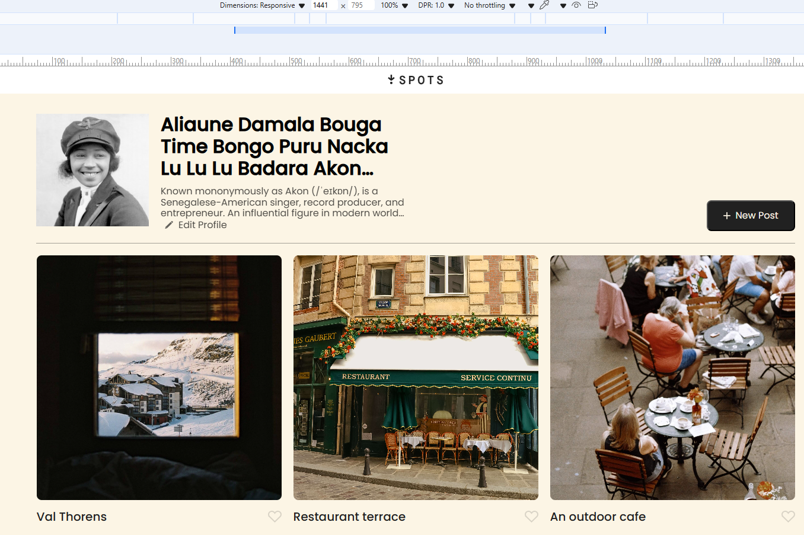
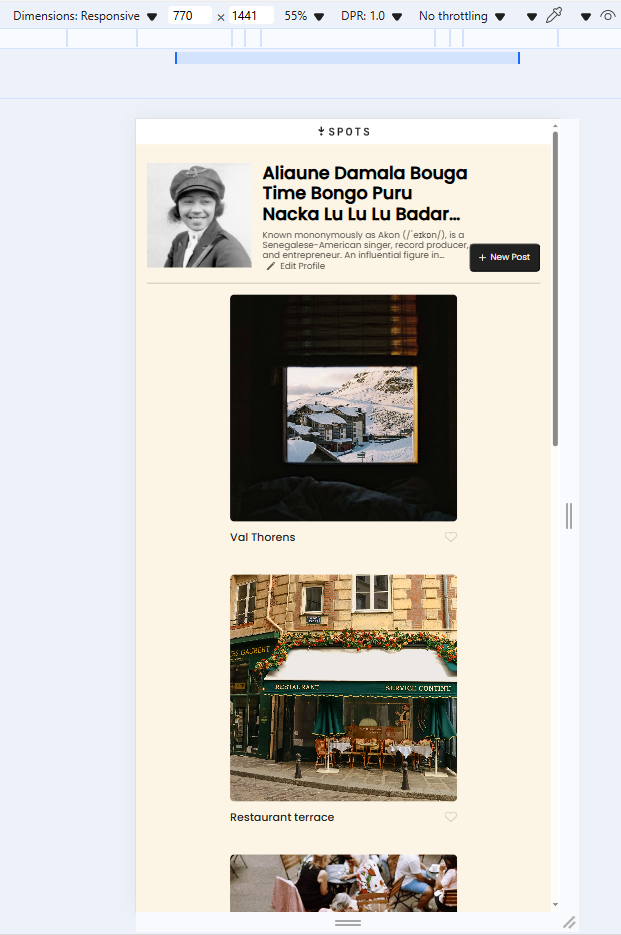

# Project 3: Spots

An image sharing site.

## Description

Spots is a sleek, user-friendly web application that lets users save, organize, and revisit articles across popular topics like travel, entertainment, and history. Whether you're curating your own reading list or diving into new discoveries, Spots keeps your favorite stories just a click away.

- Key Features

* Save Articles: Bookmark articles for later reading with a clean, intuitive interface.
* Topic-Based Browsing: Explore curated content in travel, entertainment, and history.
* Responsive Design: Optimized for all major screen sizes—from mobile to desktop—ensuring seamless display and usability.
* SEO-Friendly Structure: Includes well-crafted meta descriptions to improve visibility in search results and attract more users.

## Tech Stack

- HTML: Semantic structure for accessible, SEO-friendly markup.
- CSS: Custom styling with media queries for responsive layouts and polished visual design.
- Responisve Design: Ensures consistent user experience across devices using flexible grids, scalable typography, and adaptive components.

## Images

#

## Deployment

This webpage is deployed to GitHub Pages.

- Deployment Link:(https://nbautista-html.github.io/se_project_spots/)
